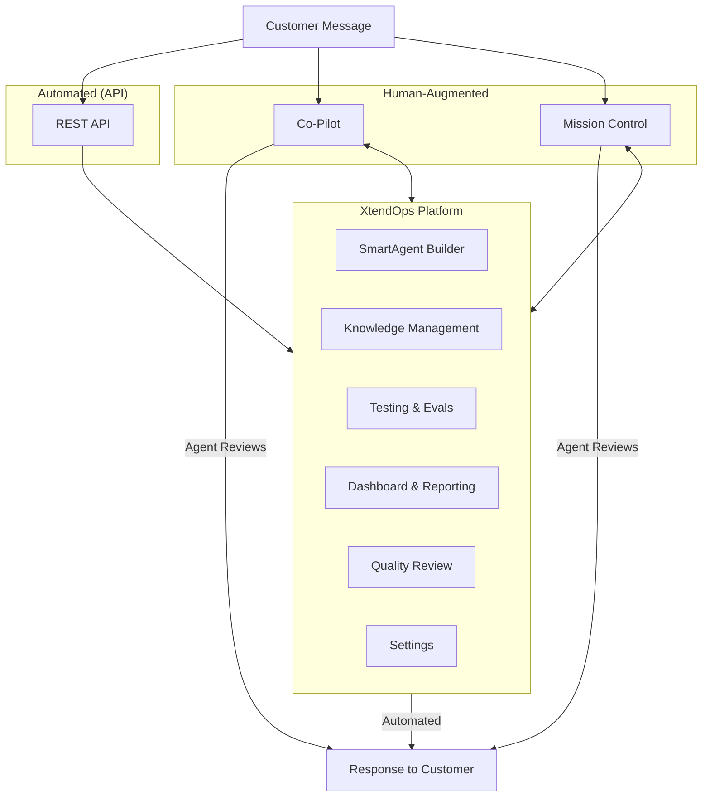

The **XtendOps Platform** is a system for building, managing, and monitoring SmartAgents — BPO-focused AI agents for customer interactions.

## Core Components



The diagram above shows how customer messages flow to the XtendOps Platform through two paths: directly via REST API for automated responses, or through the SmartAgent App (Co-Pilot or Mission Control) for human-augmented interactions.

### XtendOps Platform (xoos.xtendops.com)

Build, manage, and monitor SmartAgents:

- **SmartAgent Builder** - Visual workflow editor
- **Testing Suite** - Eval management
- **Knowledge Management** - Article repository
- **Dashboard** - Metrics and analysis
- **Quality** - Feedback and review
- **Settings** - Users, integrations, AI keys

[Platform documentation →](/platform/smartAgentBuilder)

### SmartAgent App

Deploy SmartAgents for end-user access:

**Co-Pilot** - AI-suggested responses embedded in CRMs (Zendesk, Genesys)
[Learn more →](/smartAgentApp/coPilot)

**Mission Control** - Chrome extension for conversational AI assistance
[Learn more →](/smartAgentApp/missionControl)

## Data Flow

### Automated SmartAgent (API)

```
Customer Message → SmartAgent → [Steps Execute] → Response → [Optional Events]
```

Steps can include: Knowledge Search, API Calls, LLM Processing, Structured Output

### Human-Augmented SmartAgent (Co-Pilot)

```
Customer Message → SmartAgent → AI Draft → Agent Reviews/Edits → Final Message → Feedback Score
```

Agent can: Trigger SmartActions, Regenerate response, Edit directly

## Integrations

**External Systems:**
Connect to any REST API or MCP endpoint via the [REST API Call step](/steps/rest-api-call) or [MCP step](/steps/mcp). Credentials stored in [Settings](/platform/settings).

**Co-Pilot Embeds:**
Zendesk, Genesys [Installation guides →](/smartAgentApp/supportedIntegrations)

**AI Providers:**
OpenAI, Anthropic, Google (Vertex AI, Gemini), Azure OpenAI, Custom endpoints

## Security & Deployment

**Authentication:** Username/Password, Google SSO, Role-based access control

**Data Isolation:** Client accounts are isolated with separate data, permissions, and configurations

**Credential Management:** API credentials and AI keys stored securely in Settings, separated from workflows

**Multi-Tenancy:** Shared infrastructure with isolated data per client account

[Settings documentation →](/platform/settings)

## Related Pages

- [Definitions](/getStarted/definitions) - Key terminology
- [SmartAgent Builder](/platform/smartAgentBuilder) - Build workflows
- [Step Types](/steps/smartAgentSteps) - Modular building blocks
- [SmartAgent App](/smartAgentApp/overview) - Deployment options
